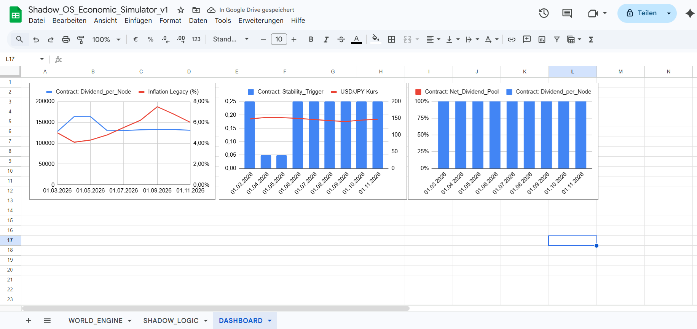
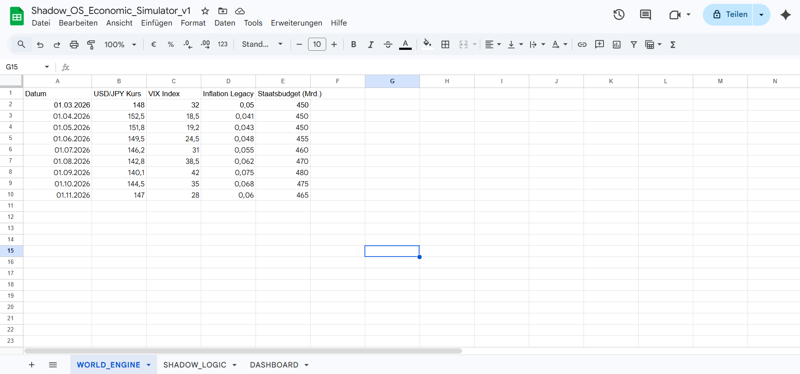
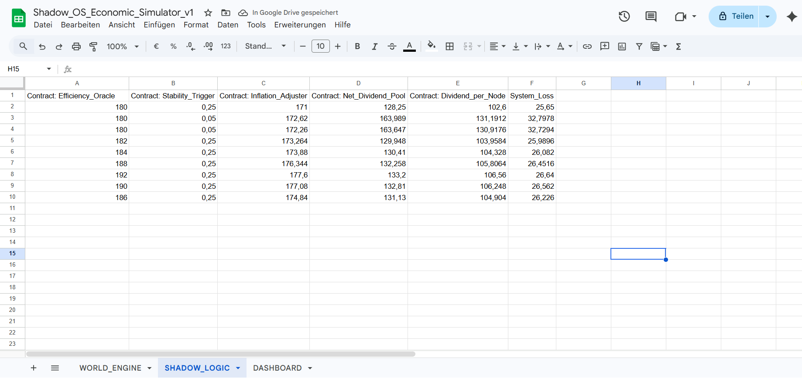
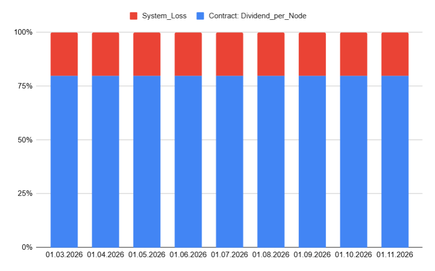

# 📉 Shadow OS: Economic Logic Simulator (v1.0)

Dieser Ordner enthält den logischen Prototyp des Shadow OS in Form einer interaktiven Simulations-Engine. Bevor der Root-Contract in Code (Solidity/C++) gegossen wird, dient diese Simulation zur Validierung der ökonomischen Logik unter Stressbedingungen.

## 🎯 Zweck der Simulation
Die Simulation beweist die Resilienz des Shadow OS gegenüber makroökonomischen Schocks, insbesondere der **"Phase of Maximum Structural Instability"** (z.B. Zusammenbruch des Yen-Carry-Trades oder extreme Inflation). 

Ziel ist es, den algorithmischen Übergang von einer inflationsgetriebenen Fiat-Ökonomie zu einem effizienten, asset-gedeckten System mathematisch zu verifizieren.

## 🏗️ Aufbau der Datei (`.xlsx`)

Die Simulation ist in drei logische Schichten unterteilt, die den späteren Tech-Stack widerspiegeln:

### 1. WORLD_ENGINE (Input Layer)
Hier werden die externen Marktdaten eingespeist. 
* **Trigger-Metriken:** USD/JPY Wechselkurs, VIX Index, Inflationsdaten und Staatsquoten der Legacy-Systeme.
* **Anpassbarkeit:** Nutzer können eigene Szenarien (z.B. Hyperinflation oder Deflationsschocks) eingeben, um die Reaktion des Systems zu testen.

### 2. SHADOW_LOGIC (Processing Layer / Smart Contracts)
Diese Ebene bildet die mathematischen Funktionen der Smart Contracts ab:
* **Efficiency_Oracle:** Berechnet die automatische Reduktion der Verwaltungskosten durch algorithmische Prozesse.
* **Stability_Trigger:** Reagiert algorithmisch auf Währungsschwankungen (z.B. automatische Erhöhung der Asset-Deckung bei USD/JPY < 150).
* **Dividend_Distributor:** Berechnet die monatliche Auszahlung basierend auf der Netto-Effizienz.
* **System_Loss (Spalte F):** Dokumentiert die verbleibende Systemreibung und dient als Puffer zur Absicherung.

### 📸 Visual Audit & Dashboard
Das Dashboard visualisiert die Resilienz-Strategie: Kaufkraft-Erhalt, der algorithmische Stability-Trigger (Yen-Schutz) und das hocheffiziente Auszahlungsverhältnis.

#### Transparenz-Check (Back-End)
| A) Marktdaten (Engine) | B) Logik (Contract) | C) Wirkungsgrad (Ratio) |
| :--- | :--- | :--- |
|  |  |  |

## 🧠 Die Logik hinter den Zahlen

Das System operiert nach dem Prinzip der **maximalen Extraktion von Ineffizienz**. Während traditionelle Finanzsysteme durch Bürokratie und Inflation Wert vernichten, schützt der Shadow OS Algorithmus den Wertbestand durch:

1. **Dynamische Asset-Sicherung:** Der Trigger (Spalte C in World Engine) schützt den Wertbestand vor der kurzfristigen Auszahlung, sobald die Marktstabilität (Yen-Trade) bricht.
2. **Efficiency Dividend:** Das System erkennt unnötige Kostenstrukturen und wandelt diese direkt in Nutzer-Dividenden um.

## 📊 Interpretation: Shadow OS vs. Fiat-Entwertung

Die grafische Auswertung der Simulation (Dashboard) verdeutlicht die Geburtsstunde einer algorithmischen Zuflucht. 

* **Resilienz:** Bei externen Schocks (simulierter Yen-Kollaps) greift der *Stability Trigger*. Das System drosselt kurzzeitig die Auszahlung, um die Asset-Deckung zu erhöhen. Das schützt den langfristigen Wertbestand.
* **Kaufkraft-Erhalt:** Während der Bürger im alten System real verarmt, entkoppelt sich das Shadow OS durch automatisierte Effizienzgewinne.
* **Efficiency Ratio:** Das 100%-gestapelte Diagramm beweist visuell: Über 80% des generierten Wertes fließen direkt an die Nodes (Nutzer), während der "System-Loss" (Rot) minimiert wird.

Diese Simulation beweist: Das Shadow OS ist eine mathematische Notwendigkeit für eine stabile Zukunft in Zeiten maximaler struktureller Instabilität.

## 🚀 Nutzung
1. Lade die Datei `shadow_os_simulation_2026.xlsx` herunter.
2. Öffne sie in Excel oder Google Sheets.
3. Ändere die Werte im Reiter `WORLD_ENGINE`, um zu sehen, wie sich die Dividende und die Systemsicherheit in Echtzeit anpassen.

## 🛠️ Roadmap: From Logic to Code
- [x] Logik-Design (Excel Prototype)
- [x] Mathematisches Stress-Testing (Yen-Shock Scenario)
- [ ] Portierung der Logik in Smart Contracts (Solidity)
- [ ] Integration des Real-Time Oracle Feeds
